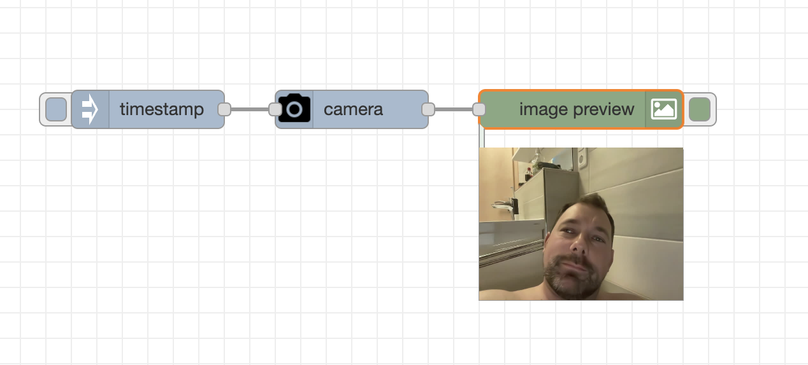

node-red-contrib-camera-mac
================

Node-RED node for taking pictures with the built-in mac or macbook camera
## Configuration

1. Drag the `camera-mac` node from the palette onto the flow canvas.
2. Double-click the node to open its configuration panel.
3. Configure the `Output Path` and `File Name` based on your preferences.
4. Click "Deploy" to apply the changes.

## Usage

Once configured, the `camera-mac` node will capture an image from the built-in camera on a Mac using the `ffmpeg` command.

The captured image will be available as a buffer in the payload of the output message. Additionally, the file path is provided in the `filePath` property of the message for reference.

## Sample Flow
You can make this json string into a flow by using the node-red flow import function.

- [sample.json](examples/sample.json)

## License

This project is licensed under the MIT License - see the [LICENSE](LICENSE) file for details.
